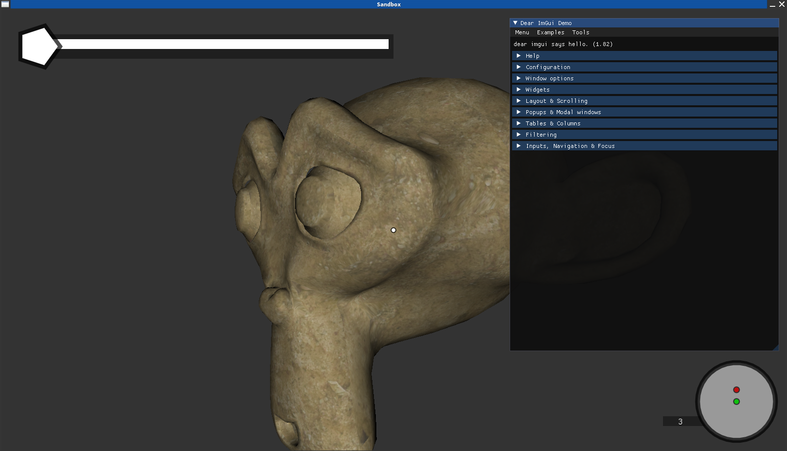

# D.D.Engine
DDEngine stands for "Dropsoft Demo Engine".
(The name is also a reference to D.D. Yugioh cards)

This engine was first designed to be a game engine as well as demo engine.
I decided to split these 2 engine types into their own repos.

After a complete rewrite of the game engine this repository here
will host the **demo engine**.

It will continiously be worked on to fit this need more and more.
It will also be used for testing purposes to test architectures and designs before
implementing them in the game engine.
This means this repository has a low priority.

So: WARNING! Don't expect a stable engine here!

Here is a screenshot of how an application using the engine can look like:



## Build
### Dependencies
You need to have cmake, clang, git and ninja installed to build this engine!

### One liner
```
git clone https://github.com/Erarnitox/DDEngine && cd DDEngine && cmake --preset release && cmake --build release
```

### Select presets
You can use `cmake --list-presets` to get an overview of the possible build types.
Chose one and run cmake --preset `<preset_name>`.

- release : build files are in the ./release folder
- debug : build files are in the ./debug folder
